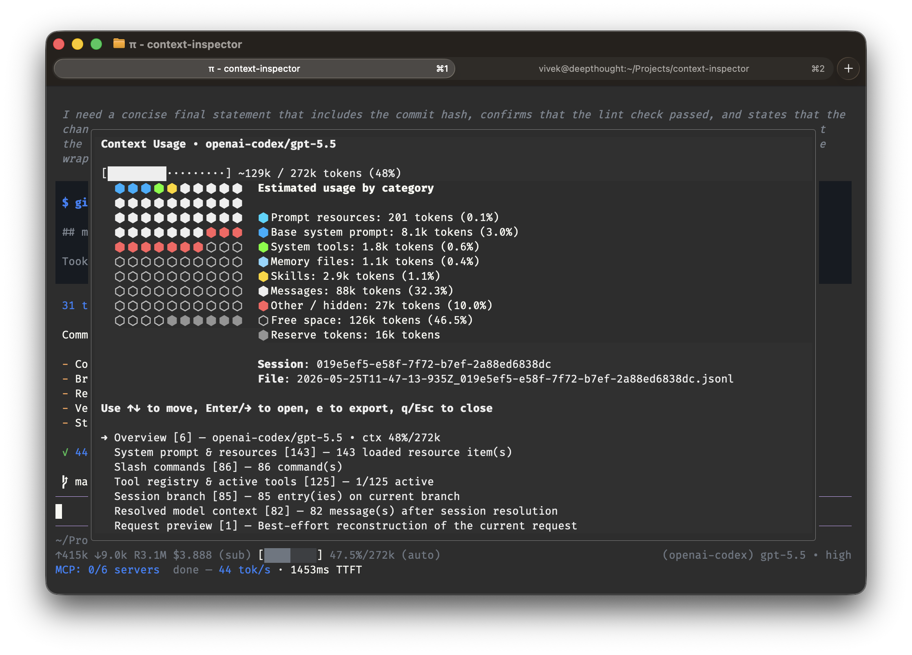

# Context Inspector

This extension adds the `/context` command.



## What it shows

The inspector is a read-only snapshot of the current Pi session. It groups the current state into sections:

- **Overview** — cwd, session file, session id, model, thinking level, usage
- **System prompt & resources** — custom prompt, appended prompt, context files, skills, tool snippets, fallback prompt
- **Slash commands** — registered commands
- **Tool registry & active tools** — all tools and which ones are active
- **Session branch (raw entries)** — the session branch history
- **Resolved model context** — the final message list after session resolution
- **Request preview** — a compact summary of the request that would be sent

## Linting

Install dev dependencies in the package directory, then run:

```bash
npm run lint
npm run lint:watch
npm run check
```

These use TypeScript's compiler to surface type and syntax errors without emitting files.

## Usage view

At the top, the inspector shows estimated context usage:

- a usage bar
- a colored 10×10 usage grid
- a category legend
- `Reserved blocks` at the end when compaction reserves tokens

The category colors are just visual helpers. They do not change behavior.

## How it works

1. **Cache prompt info**
   - On `before_agent_start`, the extension stores the latest system prompt and prompt options.

2. **Build a snapshot**
   - `buildSnapshot()` gathers everything into one immutable object.
   - This keeps the UI stable while you move around inside it.

3. **Estimate usage**
   - `estimateUsageCategories()` approximates token usage from prompt resources, resolved messages, and compaction settings.
   - These numbers are estimates, not exact accounting.

4. **Render lines**
   - `buildInspectorLines()` turns the snapshot into plain text lines.
   - `styleInspectorLines()` adds the border and colors.

5. **Interact**
   - Arrow keys move between sections/items.
   - Enter or → expands a section.
   - ← or Esc collapses.
   - `e` exports the snapshot to `.pi/context-snapshot.json`.
   - `q` closes the inspector.

## Notes

- The inspector only opens in an interactive UI session.
- It refuses to open while the current turn is still running.
- Export is also only available from an idle interactive session.
